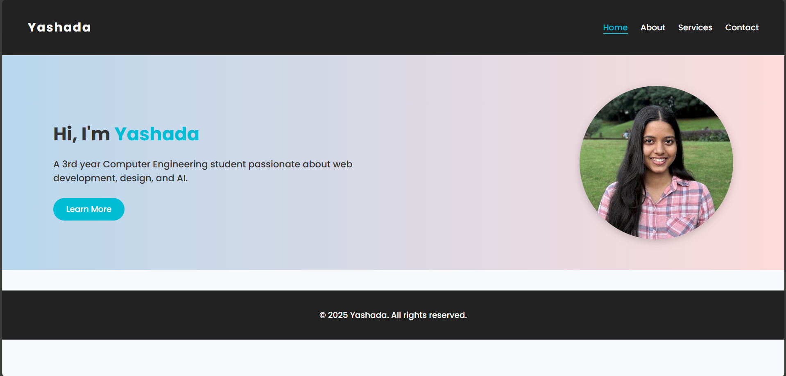
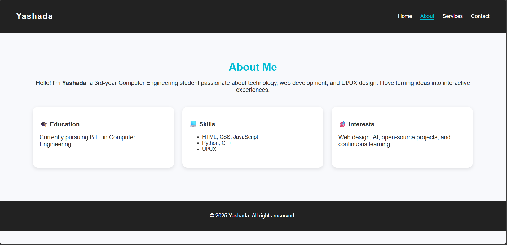

# 🌐 Yashada's Portfolio Website

A simple, modern, and responsive **personal portfolio website** built using **HTML and CSS**.  
This project showcases my background, skills, and contact details — designed with a clean, minimal, and professional layout.

---
### 🖼️ Preview




## 🏠 Project Overview

This portfolio website serves as a digital introduction — built to highlight my journey as a **Computer Engineering student** and demonstrate my front-end development skills.

It contains multiple sections:
- A **hero section** introducing who I am
- A detailed **About** page
- A **Services** page outlining my skills and work areas
- A **Contact** page for communication

---

## 🧩 Project Structure
Basic_portfolio/
│
├── index.html # Home page
├── about.html # About page
├── services.html # Services page
├── contact.html # Contact page
├── style.css # Shared stylesheet for all pages
└── README.md # Project documentation (this file)

---

## ✨ Features

- 🏠 **Home Page** – Hero section with introduction and profile image  
- 🙋‍♀️ **About Page** – Highlights education, skills, and interests  
- 🛠️ **Services Page** – Lists technical and creative services offered  
- 📞 **Contact Page** – Contact form layout with input validation structure  
- 🎨 **Single CSS File** – Consistent design across all pages  
- 📱 **Responsive Layout** – Works seamlessly on mobile and desktop  

---

## 🎨 Design Highlights

- Modern **Google Font (Poppins)** for clean typography  
- **Color scheme:**  
  - Primary accent – `#00bcd4` (cyan)  
  - Background – `#f8f9fc` (light gray)  
  - Header/Footer – `#222` (dark gray)  
- Rounded corners, smooth hover transitions, and subtle shadows  
- Clean **Flexbox & Grid** layouts for alignment and spacing  

---

## 🧠 Technologies Used

| Technology | Purpose |
|-------------|----------|
| **HTML5** | Structure and content |
| **CSS3** | Styling and layout |
| **Google Fonts** | Typography (Poppins font) |
| **Flexbox & Grid** | Responsive layouts |

---

## 🖼️ Image Suggestions

To make your portfolio visually appealing, you can include the following:

| Section | Suggested Image | File Name | Source |
|----------|------------------|-----------|--------|
| **Hero Section** | Your profile photo or avatar | `profile_photo_yj.jpeg` | Use your own or from [Pexels Portraits](https://www.pexels.com/search/profile%20portrait/) |
| **About Page** | Coding or teamwork illustration | `about_illustration.png` | [Undraw.co](https://undraw.co/illustrations) |
| **Services Page** | Web design / AI / development icons | `webdev.png`, `ai.png` | [Flaticon.com](https://www.flaticon.com/) |
| **Contact Page** | Minimal tech background | `contact_bg.jpg` | [Unsplash](https://unsplash.com/s/photos/abstract-background) |

Create an `/images` folder for these:
Basic_portfolio/
└── images/
├── profile_photo_yj.jpeg
├── about_illustration.png
├── webdev.png
├── ai.png
└── contact_bg.jpg


And use them in your HTML like:
```html

